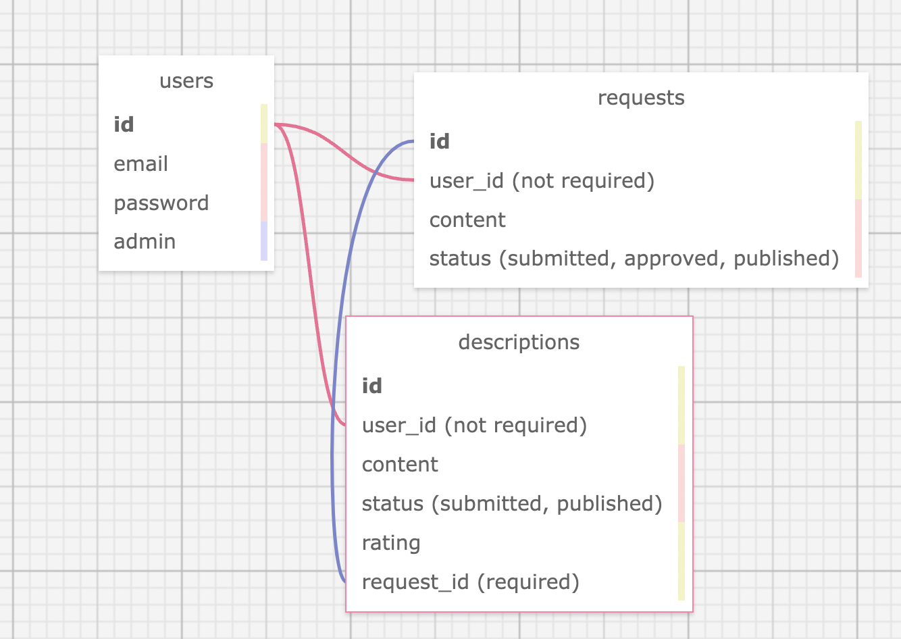

# README

This README would normally document whatever steps are necessary to get the
application up and running.

Things you may want to cover:

* Ruby version

* System dependencies

* Configuration

* Database creation

* Database initialization

* How to run the test suite

* Services (job queues, cache servers, search engines, etc.)

* Deployment instructions

* ...

### Research & Planning Log
#### Friday, 02/18
* 8:30: Create app with webpacker=react flag
* 8:45: Capstone proposal 
* 9:00: Plan database with sqldesigner, add to readme
* 9:45: Start building out database ?
* 10:45: Set up Devise ?
* 11:00: Testing
* 1:00: Devise set up authentication controllers
* 2:00: Work on API requests
* 3:30: Watch Youtube video CRUD React 40 minutes https://www.youtube.com/watch?v=oyjzi837wME&t=243s

#### Sunday, 02/20

* 6:00-7:40: Work on API, test endpoints in Postman. Finish API for descriptions and requests done!
* 7:45-8:45: Modify user model look up devise stuff